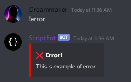

# ⚙️ DSErrorsGenerator
DSErrorsGenerator создана для упрощения создания сообщений о пользовательских ошибках. / DSErrorsGenerator designed to simplify the creation of user error messages.


## ⬇️ Установка / Install
```python
pip install DSErrorsGenerator
```

## 📚 Документация / Documentation
[](https://github.com/FeeFort/discord-error-generator/blob/main/documentation-ru.md)
[](https://github.com/FeeFort/discord-error-generator/blob/main/documentation-en.md)

## 💻 Пример кода / Example of the code
```py
@bot.command()
async def error(ctx):
    await Eg(description="This is example of error.", lang="en").send_error(ctx)
```


## 🤙 Подать идею для развития / Submit an idea for development
[](https://discord.com/users/435463855250866176)
