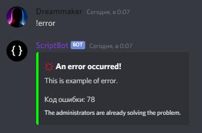

# 📖 Description

DSErrorsGenerator designed to simplify the creation of user error messages. The library automatically generates an Embed with the error text, and sends it.

# ⚙️ Parameters

Parameter | Type | Requered | Standard value | Information |
--- | --- | --- | --- |---
Title | `String (str)` | No | `Ошибка!` | The header of the embed that reports the error.
Description | `String (str)` | Yes | `None` | Description of the error.
Color | `Integer (int)` | No | `0xFF0000 (Красный)` | The color of the embed.
Emoji | `String (str)` | No | `❌` | The emoji in the title.
Code | `Integer (int)` | No | `None` | Error code (if available).
Footer | `String (str)` | No | `None` | Embed footer

# ❌ Errors

Error | Information
--- | --- 
`MissingArgument` | Raised, when one of the required arguments (Description and ctx) was omitted.
`BadObjectType` | Raised, when the object type does not match the expected type.
`MissingEmoji` | Raised, when an emoji is missing from the Emoji object.

# 🛠️ Functions

Name | Type | What the function does
--- | --- | ---
`send_error()` | Coroutine | Used for generating and sending Embed messages.
`generate_error()` | Coroutine | Used to generate an Embed message. Recommended if you want to make any additional changes.

In the arguments of `send_error()` function, you must pass `ctx`

# 💡 Examples

Import:
```py
from DSErrorsGenerator import ErrorGenerator
```

Use function:
```py
await ErrorGenerator(description="Here you can describe the error.", <Other arguments>).function()
```

Example of the code:
```py
import discord
from discord.ext import commands

from DSErrorsGenerator import ErrorGenerator as Eg

bot = commands.Bot(command_prefix="!")

@bot.event
async def on_ready():
    print(f"[{bot.user}] Ready!")

@bot.command()
async def error(ctx):
    await Eg(description="This is example of error.").send_error(ctx)

bot.run("token")
```


Passing all existing arguments:
```py
@bot.command()
async def error(ctx):
    await Eg(description="This is example of error.", title="An error occurred!", color=0x00FF00, code=78, emoji="💢", footer="The administrators are already solving the problem.").send_error(ctx)
```


